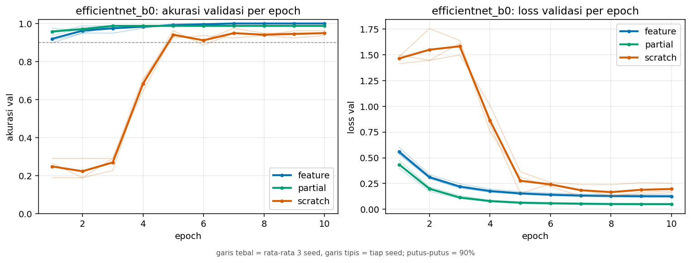
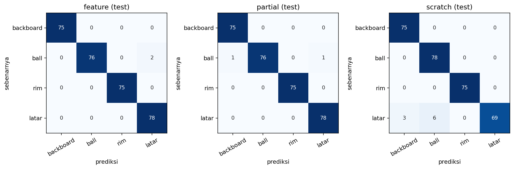

# Transfer Learning untuk Klasifikasi Objek Basket (backboard, ball, rim)

Tugas RET503 Computer Vision and Deep Learning, Pertemuan 3 (Transfer Learning dan Fine-Tuning).
Proyek: persepsi robot humanoid untuk **FIRA HuroCup 2027, kategori Basketball** (Barelang FC, Politeknik Negeri Batam).

**Model:** EfficientNet-B0 pretrained ImageNet (torchvision), salah satu dari lima model pada slide 14.
**Mode:** `feature`, `partial`, dan `scratch` dibandingkan (slide 21); mode terpilih `feature` (akurasi test 99,3 ± 0,5%).

## Isi repositori

```
├── README.md
├── docs/desain.md              # dokumen desain awal (template slide 18)
├── dataset_raw/                # dataset klasifikasi: <kelas>/*.jpg + metadata.csv
├── sumber_frame/               # frame asli + label YOLO (sumber potongan)
├── colab/jalankan_di_colab.ipynb
├── scripts/
│   ├── make_crops.py           # frame beranotasi -> dataset_raw (split blok anti-leakage)
│   ├── train.py                # 5 model x 3 mode
│   ├── report.py               # tabel + grafik per epoch + confusion matrix
│   ├── latency.py              # latensi pre/inferensi/post untuk 5 model
│   └── contoh_kelas.py
├── results/                    # history.csv, summary.json, tabel, grafik
└── requirements.txt
```

## Data

Frame diambil dari kamera robot (e-con See3CAM_CU135 di kepala humanoid) pada **24 September 2026 di lab BRAIL**, cahaya netral, di-capture tiap 0,5 detik saat robot dijalankan: **181 frame dari satu rekaman**. Frame dianotasi di Roboflow (tiga kotak: backboard, ball, rim) dalam format YOLO untuk proyek detektor berikutnya. Untuk tugas ini, setiap kotak dipotong (dengan konteks 15%) menjadi satu citra klasifikasi, dan satu potongan `latar` diambil dari area tanpa objek pada tiap frame.

| Kelas | Train | Valid | Test | Total |
|---|---|---|---|---|
| backboard | 109 | 20 | 25 | 154 |
| ball (bola tenis) | 115 | 15 | 26 | 156 |
| rim | 118 | 21 | 25 | 164 |
| latar | 124 | 23 | 26 | 173 |

Setiap kelas melebihi syarat minimal 50 citra. Metadata per citra (`nama_file`, `kelas`, `tanggal`, `kondisi_cahaya`, plus split, nomor frame, bbox, sesi, kamera) ada di `dataset_raw/metadata.csv`.

**Pencegahan data leakage (slide 22).** Frame berurutan sangat mirip, sehingga split acak membuat test terlihat terlalu bagus. Di sini frame diurutkan lalu dibagi menjadi tiga **blok berurutan** (70/15/15%) dengan jeda 4 frame di batas blok (8 frame dibuang), sehingga tidak ada frame train yang bertetangga langsung dengan frame valid atau test. Cara ini belum menggantikan pemisahan per sesi: seluruh data tetap berasal dari satu rekaman.

## Metode

Praproses seragam (slide 13): ubah ke 224 × 224, RGB, normalisasi mean/std ImageNet. Augmentasi train: RandomResizedCrop (skala 0,6-1,0), HorizontalFlip, ColorJitter. Adam, CosineAnnealingLR, 10 epoch, batch 32. Layer yang beku tetap berada pada mode `eval()` untuk BatchNorm (slide 11).

| Mode | Bobot awal | Yang dilatih | Learning rate |
|---|---|---|---|
| `feature` | ImageNet | head baru saja (`classifier[1]`) | 1e-3 |
| `partial` | ImageNet | `features[7:]` (blok akhir) + head | 1e-4 / 1e-3 |
| `scratch` | acak | semua | 1e-3 |

Bagian blok akhir pada model lain: ResNet `layer4`, MobileNetV3-Small `features[9:]`, MobileNetV3-Large `features[13:]`. Mode dijalankan dengan 3 seed (0, 1, 2) karena set valid dan test kecil.

Yang dicatat (slide 21): akurasi val terbaik, waktu pelatihan, dan epoch saat akurasi val ≥ 90% (pertama kali, dan epoch setelah mana tidak pernah turun lagi).

## Cara menjalankan

```bash
pip install -r requirements.txt
python scripts/make_crops.py                                   # opsional: membuat ulang dataset_raw
python scripts/train.py --model efficientnet_b0 --modes feature partial scratch --seeds 0 1 2
python scripts/report.py --model efficientnet_b0
python scripts/latency.py --device cuda                        # tulis nama perangkat pada laporan
```

Seluruh langkah juga tersedia di `colab/jalankan_di_colab.ipynb` (GPU T4). Opsi `--model all` melatih kelima model sebagai pembanding tambahan.

## Hasil

EfficientNet-B0, 10 epoch, 3 seed (0, 1, 2) per mode; rata-rata ± simpangan baku. Set valid 79 citra, test 102 citra, GPU Tesla T4 (Google Colab).

| Mode | Param dilatih | Akurasi val terbaik | Akurasi test | Epoch val ≥ 90% (pertama / stabil) | Waktu latih |
|---|---|---|---|---|---|
| `feature` | 5.124 (0,1%) | 100,0 ± 0,0% | 99,3 ± 0,5% | 1,3 / 1,3 | 36 s |
| `partial` | 1.134.516 (28,3%) | 98,7 ± 0,0% | 99,3 ± 0,5% | 1,0 / 1,0 | 36 s |
| `scratch` | 4.012.672 (100,0%) | 95,8 ± 1,6% | 97,1 ± 1,4% | 5,0 / 5,7 | 42 s |

Akurasi test per seed: `feature` 99,0 / 100,0 / 99,0%; `partial` 99,0 / 99,0 / 100,0%; `scratch` 95,1 / 98,0 / 98,0%. Satu citra salah di test setara 1%.





Mode terpilih: **`feature`** (alasan di bagian Analisis). Data mentah per run ada di `results/efficientnet_b0_<mode>_s<seed>/` (`history.csv`, `summary.json`, `confusion_test.csv`).

## Latensi

Diukur dengan `scripts/latency.py` pada **GPU Tesla T4 (Google Colab)**, batch 1, masukan 224 × 224, 200 inferensi setelah 30 kali pemanasan, bobot acak (latensi hanya bergantung pada arsitektur). "Total" = praproses (PIL, CPU) + inferensi (GPU) + pascaproses. Anggaran slide 16: inferensi model 35 ms dari 67 ms per frame (15 FPS).

| Model | Param (juta) | GMACs | Inferensi fp32 (ms) | Total fp32 (ms) | FPS fp32 | Total fp16 (ms) | FPS fp16 |
|---|---|---|---|---|---|---|---|
| mobilenet_v3_small | 1,52 | 0,06 | 5,32 | 6,76 | 148,0 | 9,79 | 102,1 |
| mobilenet_v3_large | 4,21 | 0,22 | 8,32 | 10,22 | 97,8 | 8,87 | 112,8 |
| **efficientnet_b0** | 4,01 | 0,38 | 8,12 | 9,52 | 105,1 | 11,02 | 90,7 |
| resnet18 | 11,18 | 1,81 | 3,23 | 4,66 | 214,7 | 4,45 | 224,8 |
| resnet50 | 23,52 | 4,09 | 6,04 | 7,42 | 134,7 | 8,75 | 114,2 |

- Pada T4 urutan latensi **tidak mengikuti GMACs**: ResNet-18 (1,81 GMACs) paling cepat, sedangkan MobileNetV3 dan EfficientNet-B0 (0,06-0,38 GMACs) lebih lambat. Pada batch 1, waktu kemungkinan besar didominasi jumlah layer kecil dan peluncuran kernel, bukan jumlah operasi aritmetika.
- fp16 tidak lebih cepat daripada fp32 untuk beberapa model (mis. EfficientNet-B0: 9,52 menjadi 11,02 ms). Setiap angka berasal dari satu kali pengukuran, jadi selisih kecil bisa berupa derau.
- Semua model berada di bawah 11 ms total, jauh di bawah anggaran 35 ms. Namun T4 umumnya jauh lebih kuat daripada Jetson Xavier NX, dan di robot model dijalankan lewat TensorRT, sehingga **angka ini belum membuktikan** anggaran terpenuhi di robot. Pengukuran di Jetson menyusul.

## Analisis

1. **Bobot pretrained mempercepat belajar.** `feature` dan `partial` sudah mencapai akurasi val ≥ 90% pada epoch 1-2, sedangkan `scratch` baru pada epoch 5 (stabil di epoch 5-7) dan berhenti di sekitar 96% (val) tanpa pernah menyamai kedua mode lainnya. Kurva loss val `scratch` juga baru turun setelah epoch 3. Ini sesuai hipotesis slide 7: fitur umum dari ImageNet bisa dipakai ulang pada data yang kecil.
2. **`feature` dan `partial` setara.** Akurasi test keduanya 99,3 ± 0,5%; selisih per seed paling banyak satu citra dari 102 dan arahnya bolak-balik (seed 1 unggul `feature`, seed 2 unggul `partial`), jadi tidak ada pemenang. `partial` melatih 1,13 juta parameter (221 kali lebih banyak daripada `feature`) tanpa keuntungan terukur. Val `partial` justru sedikit lebih rendah (98,7% vs 100%), selisih satu citra dari 79. Waktu latih kedua mode sama (36 s), kemungkinan besar karena waktu didominasi pemuatan dan augmentasi data, bukan backpropagation, sehingga kolom waktu tidak membedakan mode.
3. **`scratch` lebih rendah di ketiga seed, tetapi selisihnya kecil.** Test 97,1 ± 1,4% vs 99,3%: sekitar dua citra dari 102 per seed. Konsisten arahnya, tetapi dengan test sekecil ini belum cukup untuk menyebut selisihnya pasti. Jenis kesalahannya berbeda: seluruh 9 kesalahan `scratch` (dari 78 potongan latar, dijumlah 3 seed) adalah **latar yang diprediksi sebagai ball (6) atau backboard (3)**, artinya model dari nol kurang pandai menolak area kosong, padahal itu yang menyebabkan deteksi palsu di robot. Kesalahan `feature` dan `partial` seluruhnya berasal dari kelas `ball` (2 dari 78 potongan per mode, dijumlah 3 seed; ditebak sebagai latar atau backboard), kemungkinan karena potongan bola paling kecil. Potongan yang salah belum diperiksa satu per satu.
4. **Keputusan: mode `feature`.** Val 100% pada ketiga seed, test 99,3%, hanya 5.124 parameter yang dilatih (0,13%), dan sesuai matriks keputusan slide 10 (data sedikit, domain mirip: mulai dari feature extraction). Kelas terlemahnya `ball` dengan recall 97,4%, di atas target desain 85%.
5. **Hati-hati membaca angka setinggi ini.** Akurasi mendekati 100% pada tugas ini wajar karena kelasnya mudah dibedakan (bola kuning, ring merah, papan putih, latar hijau atau gelap). Slide 22 menyarankan curiga pada skor yang terlalu bagus. Split blok mencegah frame bertetangga bocor ke test, tetapi seluruh data tetap dari **satu rekaman, satu lokasi, satu pencahayaan**, sehingga latar dan posisi robot pada test kemungkinan besar mirip dengan train. Hasil ini kemungkinan lebih optimis daripada kinerja di venue pertandingan. Langkah berikutnya yang paling berguna adalah merekam satu sesi baru (cahaya lain, lokasi lain) hanya untuk test.
6. **Pemilihan model belum diuji lewat eksperimen.** EfficientNet-B0 dipilih berdasarkan panduan slide 14 (cocok untuk Jetson); hanya model ini yang dilatih. Keempat model lain baru diukur latensinya. Perbandingan akurasi kelima model dapat dijalankan dengan `python scripts/train.py --model all`.

## Keterbatasan

- Seluruh data dari satu sesi, satu lokasi, dan cahaya netral; hasil belum membuktikan kinerja di venue lain.
- Test set hanya sekitar 100 potongan, sehingga selisih beberapa persen antar mode berada dalam derau.
- Potongan `ball` kecil (median ≈ 26 × 33 piksel) dan diperbesar ke 224 × 224.
- Potongan `latar` diambil dari adegan yang sama; kelas ini relatif mudah dibedakan lewat warna.
- Hanya EfficientNet-B0 yang dilatih; keempat model lain baru diukur latensinya.
- Latensi diukur di GPU T4, bukan di Jetson Xavier NX.
- Ini klasifikasi potongan, bukan deteksi. Menemukan lokasi objek di frame penuh adalah pekerjaan proyek detektor (YOLO) berikutnya.
