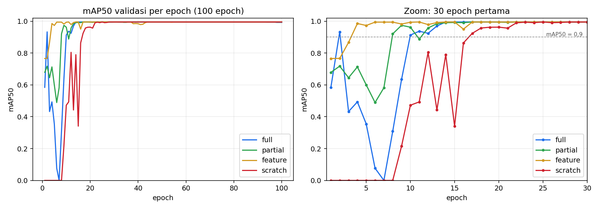

# Deteksi Backboard, Bola, dan Ring Basket dengan Transfer Learning (YOLOv8s)

Tugas RET503 Computer Vision and Deep Learning, Pertemuan 3 (Transfer Learning dan Fine-Tuning).
Proyek: persepsi robot humanoid untuk **FIRA HuroCup 2027, kategori Basketball**.

## Isi repositori

```
├── README.md                 # laporan singkat + analisis (file ini)
├── docs/desain.md            # dokumen desain awal (template slide 18)
├── dataset_raw/              # citra + label YOLO (train/valid/test) dan metadata.csv
├── data.yaml
├── results/                  # results.csv, grafik, confusion matrix, ringkasan.csv per mode
├── scripts/
│   ├── train_colab.py        # 4 mode pelatihan (dijalankan di Google Colab, GPU T4)
│   ├── make_metadata.py      # membuat metadata.csv
│   ├── split_by_block.py     # split ulang berbasis blok frame (anti data leakage)
│   └── latency.py            # ukur latensi pre/inferensi/post per model
└── requirements.txt
```

## Dataset

Sumber: citra yang dianotasi sendiri di Roboflow (workspace `muhammad-akbar-iqvi`, project `basketball-1ntcs`, versi 1), diekspor format YOLOv8. Total **181 citra**, 3 kelas (`ball` adalah bola tenis).

Pengambilan data: 24 September 2026 di lab BRAIL, cahaya netral, kamera e-con See3CAM_CU135 di kepala robot humanoid (tinggi ≈ 1 m, jarak ke ring 1-1,5 m). Robot dijalankan dan citra di-capture tiap 0,5 detik, jadi seluruhnya satu rekaman. Pra-pemrosesan Roboflow: auto-orient dan resize 640×480 (stretch), tanpa augmentasi.

| Split | Citra | backboard | ball | rim |
|---|---|---|---|---|
| train | 154 | 139 | 139 | 145 |
| valid | 18 | 15 | 13 | 17 |
| test | 9 | 8 | 8 | 10 |

Setiap kelas melebihi syarat minimal 50 citra. Detail per citra ada di `dataset_raw/metadata.csv`.

## Metode

Model dasar **YOLOv8s** dengan bobot pretrained COCO (backbone CSPDarknet, neck + head Detect). Empat strategi dibandingkan dengan setelan yang sama; yang berubah hanya layer yang dibekukan dan bobot awal.

| Mode | Bobot awal | Yang dilatih | Padanan di slide |
|---|---|---|---|
| `feature` | COCO | neck + head (`freeze=10`) | feature extraction |
| `partial` | COCO | blok akhir backbone + neck + head (`freeze=7`) | fine-tuning parsial |
| `full` | COCO | seluruh model | fine-tuning penuh |
| `scratch` | acak (`yolov8s.yaml`) | seluruh model | pelatihan dari nol |

Setelan bersama: 100 epoch, `imgsz=640`, `batch=16`, AdamW, `lr0=0.00143` (satu LR untuk semua layer), `seed=0`, augmentasi bawaan Ultralytics (mosaic, scale, flip, HSV). GPU Google Colab T4. Ultralytics 8.4.161.

## Hasil

| Mode | mAP50 val (terbaik) | mAP50 test | mAP50-95 test | Epoch pertama mAP50 ≥ 0,9 | Epoch stabil mAP50 ≥ 0,9 | Waktu latih (100 epoch) |
|---|---|---|---|---|---|---|
| full | 0,995 | 0,939 | 0,707 | 2 | 10 | 335 s |
| partial | 0,995 | 0,929 | 0,699 | 8 | 12 | 323 s |
| feature | 0,995 | 0,948 | 0,702 | 4 | 4 | 310 s |
| scratch | 0,995 | 0,957 | 0,698 | 17 | 17 | 379 s |

"Epoch stabil" adalah epoch pertama setelah mana mAP50 tidak pernah turun di bawah 0,9. Kolom ini ditambahkan karena `full` sempat mencapai 0,93 di epoch 2 lalu jatuh ke 0 di epoch 7.



Confusion matrix dan kurva PR tiap mode ada di `results/<mode>/`.

## Latensi dan perbandingan ukuran model

Diukur dengan `scripts/latency.py` (200 inferensi pada citra test, setelah 20 kali pemanasan) pada **GPU Tesla T4 (Google Colab)**, bobot PyTorch (`.pt`), input 640×640, Ultralytics 8.4.171. Angka ini bukan pengukuran pada perangkat target robot, sehingga dipakai untuk membandingkan model, bukan sebagai jaminan FPS di robot. Anggaran: 15 FPS ≈ 67 ms per frame (slide 16).

| Model (mode `full`) | Parameter | GFLOPs | mAP50 test | mAP50-95 test | Pre (ms) | Inferensi (ms) | Post (ms) | Total (ms) | FPS |
|---|---|---|---|---|---|---|---|---|---|
| YOLOv8s | 11,1 juta | 28,4 | 0,939 | 0,707 | 0,7 | 11,3 | 1,5 | 13,6 | 73,7 |
| YOLOv8n | 3,0 juta | 8,1 | 0,959 | 0,712 | 0,6 | 5,7 | 1,2 | 7,6 | 132,4 |

YOLOv8n dilatih dengan setelan yang sama seperti `full` pada YOLOv8s (100 epoch, AdamW, `lr0=0,00143`, seed 0).

Catatan penerapan: model ini direncanakan untuk robot humanoid dengan kamera di kepala; pengujian di robot menyusul.

## Analisis

1. **Transfer learning mempercepat konvergensi.** Ketiga mode pretrained sudah mencapai mAP50 ≥ 0,5 di epoch pertama, sedangkan `scratch` baru di epoch 12 dan stabil ≥ 0,9 di epoch 17. Domain sumber (COCO) cukup dekat untuk bola (kelas `sports ball`), sehingga tidak teramati negative transfer.
2. **`feature` paling stabil, `full` paling tidak stabil di awal.** Dengan `lr0=0,00143` pada seluruh layer, `full` kehilangan akurasi di epoch 3-8 (turun sampai 0) sebelum pulih di epoch 10. Ini sesuai pesan slide 12: fine-tuning penuh membutuhkan LR yang jauh lebih kecil. Mode dengan backbone beku (`feature`) tidak mengalami penurunan itu.
3. **Akurasi akhir praktis sama.** mAP50 val mencapai 0,995 untuk semua mode (jenuh). mAP50 test berkisar 0,929-0,957, tetapi test set hanya 9 citra dengan 26 kotak, sehingga selisih itu setara satu-dua kotak dan tidak cukup untuk menyimpulkan mode mana yang lebih baik. Hasil `scratch` yang sedikit lebih tinggi di test **bukan** bukti bahwa pelatihan dari nol lebih baik. mAP50-95 tertinggi dimiliki `full` (0,707), selisihnya tipis.
4. **Waktu pelatihan:** `feature` ≈ 7% lebih cepat dari `full`; `scratch` ≈ 13% lebih lambat dari `full` (waktu dinding, termasuk validasi tiap epoch).
5. **Keterbatasan: data leakage.** Seluruh 181 citra bernomor frame berurutan 1530-1710 (satu rekaman) dan dibagi acak, sehingga frame val/test bertetangga dengan frame train (misalnya test 1532 dan 1533 di antara train 1530, 1531, 1534). Skor valid 0,995 untuk semua mode adalah tanda khas hal ini. Angka di atas hampir pasti terlalu optimis untuk kondisi lapangan baru (hall, cahaya, sudut kamera lain). Dataset juga diekspor dengan resize 640×480 *stretch*, sehingga rasio aspek citra latih berbeda dari citra kamera asli. Mitigasi: `scripts/split_by_block.py` (split blok berurutan dengan jeda), dan menambah rekaman dari sesi/lokasi berbeda, terutama untuk test.
6. **YOLOv8n vs YOLOv8s.** YOLOv8n memiliki sekitar 3,7 kali lebih sedikit parameter dan berjalan sekitar 1,8 kali lebih cepat (7,6 ms vs 13,6 ms per frame di T4), dengan mAP test yang setara (0,959 vs 0,939 untuk mAP50; selisih itu masih dalam rentang derau test set 9 citra). Pada data ini, kapasitas tambahan YOLOv8s tidak memberi keuntungan akurasi yang terukur.
7. **Kesimpulan sementara.** Model pretrained COCO lebih baik daripada dari nol dalam kecepatan konvergensi. Sebagai kandidat untuk robot dipilih **YOLOv8n dengan fine-tuning penuh**: akurasinya setara YOLOv8s tetapi jauh lebih ringan, sehingga memberi ruang pada perangkat yang lebih lemah dari T4. Keputusan akhir menunggu split ulang tanpa leakage dan pengukuran di perangkat target.

## Cara menjalankan ulang

```bash
pip install -r requirements.txt
python scripts/make_metadata.py                # membuat dataset_raw/metadata.csv
python scripts/split_by_block.py               # opsional: dataset_session/ tanpa leakage
python scripts/train_colab.py                  # 4 mode (butuh GPU)
python scripts/latency.py results/full/weights/best.pt
```

Bobot (`best.pt`, ONNX) tidak disimpan di repo karena ukurannya.
