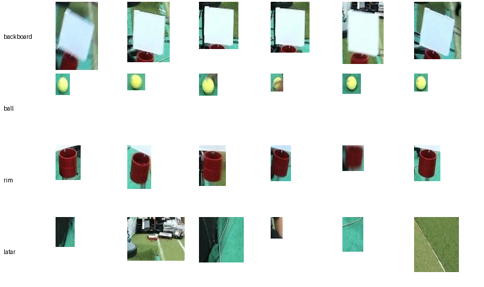

# Dokumen Desain Awal: Persepsi Objek Basket untuk FIRA HuroCup 2027

RET503 Computer Vision and Deep Learning, Pertemuan 3 (CDIO Stage #2 Design). Pemilik: Muhammad Akbar Iqvi (NIM 4222401006), Barelang FC, Politeknik Negeri Batam.

## 1. Misi proyek
Robot humanoid pada kategori Basketball FIRA HuroCup 2027 harus menemukan **bola tenis**, **ring (rim)**, dan **papan pantul (backboard)** dari kamera di kepalanya, lalu memakai posisi ketiganya untuk menentukan arah dan jarak lemparan. Pada tahap ini perception diselesaikan sebagai **klasifikasi potongan citra** (apa isi kotak ini?) dengan transfer learning; detektor penuh (menemukan kotaknya) dikerjakan pada proyek berikutnya.

## 2. Kelas objek
Empat kelas: `backboard`, `ball`, `rim`, dan `latar` (area tanpa objek, agar model belajar menolak yang bukan target).

## 3. Kamera dan dudukan
| Item | Isi |
|---|---|
| Kamera | e-con See3CAM_CU135, resolusi 1080p, 30 atau 60 fps |
| Dudukan | Di kepala robot humanoid, ikut bergerak saat robot berjalan atau menoleh |
| Tinggi | ± 1 m dari lantai |
| Jarak kerja | 1 - 1,5 m dari titik lempar ke ring |
| Konfigurasi saat ini | Node persepsi membuka 1280 × 720, MJPG, 30 fps |

## 4. Unit komputasi
NVIDIA Jetson Xavier NX, mode daya `MODE_20W_6CORE`, JetPack 5.1.1 (L4T R35.3.1), TensorRT 8.5.2, ROS 2 Foxy. Inferensi direncanakan dengan TensorRT FP16.

## 5. Target kinerja
| Metrik | Target |
|---|---|
| Akurasi test (klasifikasi 4 kelas) | ≥ 90% (ambang yang sama dengan slide 21), dilaporkan rata-rata beberapa seed |
| Recall per kelas pada test | tidak ada kelas target di bawah 85% |
| Latensi inferensi model | ≤ 35 ms per citra di Jetson (anggaran slide 16: 15 FPS ≈ 67 ms untuk seluruh pipeline) |
| Latensi ROS 2 | diukur setelah node terpasang di robot |

## 6. Kandidat model
| Kandidat | Parameter (kepala 1000 kelas) | Alasan |
|---|---|---|
| **EfficientNet-B0** (terpilih) | ≈ 5,3 juta | Pada tabel slide 14 ditandai "cocok untuk Jetson", sama dengan unit komputasi robot; akurasi ImageNet 77,7% |
| MobileNetV3-Large (cadangan) | ≈ 5,5 juta | Lebih ringan (0,22 GFLOPs); dipakai bila latensi EfficientNet-B0 melebihi anggaran |

Kelima model slide 14 diukur latensinya (`scripts/latency.py`) sebagai pembanding. Hasil di GPU T4 (batch 1, fp32): EfficientNet-B0 9,5 ms total (105 FPS); semua model ≤ 10,3 ms. Pengukuran di Jetson (TensorRT FP16) belum dilakukan.

## 7. Strategi transfer learning
Titik awal: **feature extraction**, lalu **fine-tuning parsial** (matriks keputusan slide 10). Alasannya: data hanya ratusan potongan per kelas, dan domain sumber (foto ImageNet) dekat dengan domain target (foto berwarna dari kamera robot), meskipun potongan kami buram karena gerakan. Mode `scratch` dilatih sebagai pembanding untuk menunjukkan manfaat bobot pretrained. **Hasil P2 (3 seed):** `feature` dan `partial` sama-sama 99,3 ± 0,5% di test dan lebih cepat konvergen daripada `scratch` (97,1 ± 1,4%); dipilih **`feature`** karena hanya melatih 5.124 parameter tanpa kehilangan akurasi. Target kinerja bagian 5 untuk akurasi dan recall terpenuhi pada data satu sesi ini; belum teruji pada sesi lain.

## 8. Rencana data
- Sumber: kamera robot, 24 September 2026, lab BRAIL, cahaya netral, di-capture tiap 0,5 detik saat robot dijalankan (satu rekaman, 181 frame).
- Anotasi kotak di Roboflow untuk tiga kelas, dipotong menjadi dataset klasifikasi: **154 backboard, 156 ball, 164 rim, 173 latar** (≥ 50 per kelas).
- Split berdasarkan **blok frame berurutan dengan jeda** (train 70%, valid 15%, test 15%), bukan acak, untuk mencegah data leakage (slide 22).
- Variasi yang belum ada: cahaya redup atau berjendela, lokasi lain, jarak jauh, bola di tangan atau di udara. Direncanakan sesi berikutnya.

## 9. Risiko dan mitigasi
| Risiko | Mitigasi |
|---|---|
| Data leakage: frame berurutan mirip masuk ke train dan test | Split blok berjeda; test dari sesi baru bila tersedia |
| Hanya satu sesi, cahaya netral: model gagal di venue lain | Rekam sesi tambahan (cahaya redup, lokasi lain); augmentasi ColorJitter |
| Potongan bola sangat kecil (median ≈ 26 × 33 piksel) lalu diperbesar ke 224 × 224 sehingga detailnya hilang | Beri konteks (15% di sekeliling kotak); uji ukuran masukan lebih besar atau kamera lebih dekat |
| Motion blur saat kamera di kepala bergerak | Sertakan sampel buram di train (sudah ada); uji kecepatan rana kamera |
| Test set kecil (≈ 100 potongan), hasil berfluktuasi | Ulangi dengan 3 seed dan laporkan rata-rata ± simpangan baku |
| Latensi di Jetson melebihi anggaran | Beralih ke MobileNetV3-Large; TensorRT FP16 |
